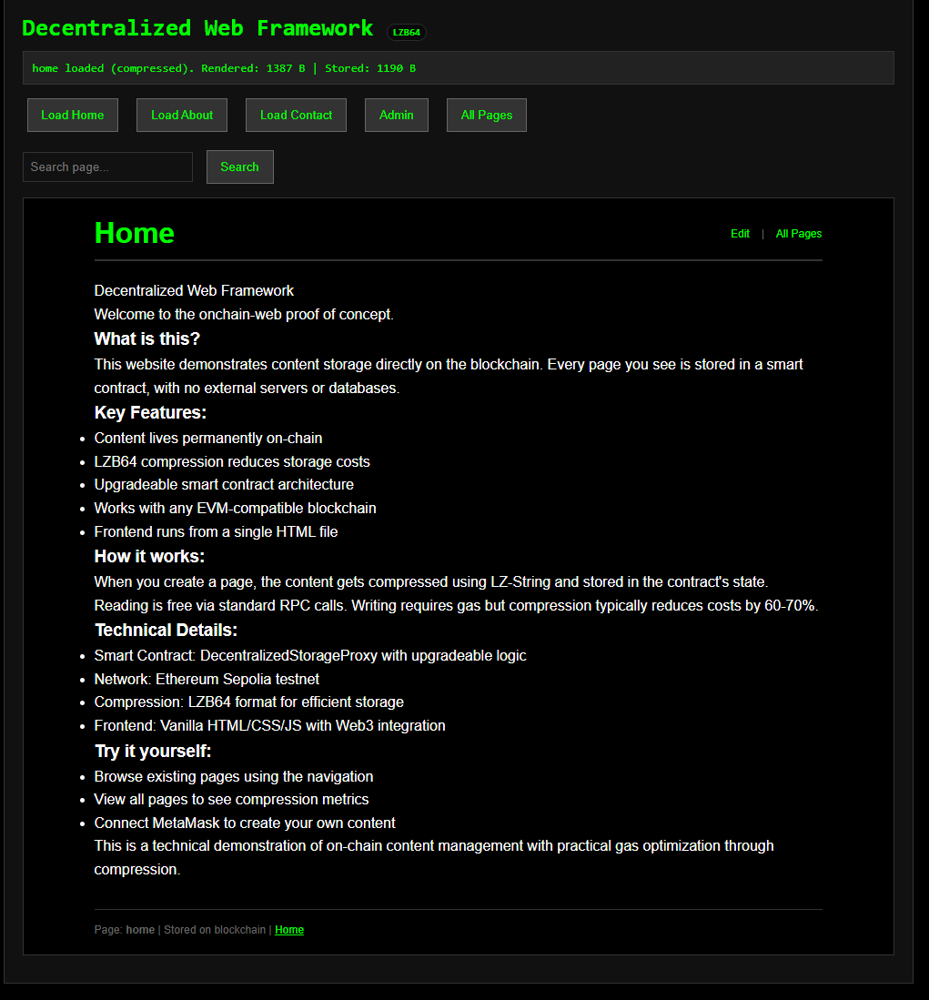
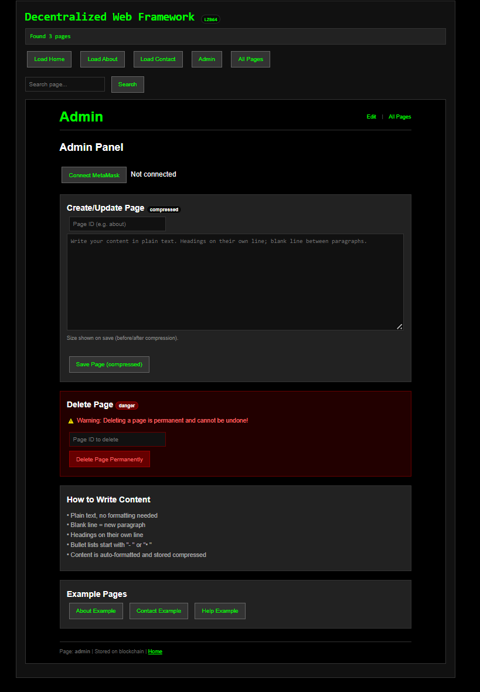
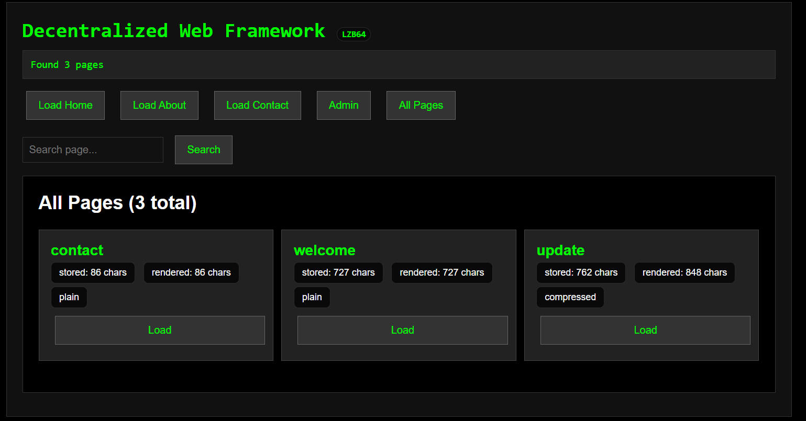

# Decentralized-Web-Framework
A minimal framework for storing and retrieving content directly in a smart contract.
- All content is stored on-chain
- Frontend is a single HTML file
- Compression reduces storage size
- Upgradeable via proxy pattern
- Works with any EVM-compatible chain

## Screenshots

### Frontend Interface

### Admin Panel

### Page Discovery

---

## Overview
This system stores text-based content (HTML, JSON, plain text) directly in a smart contract.  
No external storage is used.  
The frontend reads and writes via standard blockchain calls.

The system is designed to be:
- Simple
- Portable
- Persistent
- Open

---

## Components

### 1. `index.html`
- Frontend interface
- Handles compression (`LZB64`)
- Reads from and writes to the contract
- Can be opened from any source: web, USB, local disk
- Compatible with modern browsers (Chrome, Firefox, Safari, Edge)

### 2. `DecentralizedStorageLogicV2.sol`
- Core logic: `setPage`, `pages`, `getAllPageIds`
- Advanced features: `searchPages`, `getPageIds`, `getPagesWithContent`
- Pagination support for large datasets
- Stores content as `string`
- Supports compressed input

### 3. `DecentralizedStorageProxy.sol`
- Upgradeable proxy
- Uses `delegatecall` to forward logic
- Preserves data during upgrades

---

## Features

### On-Chain Storage
Content is stored in the contract's state.  
If the chain exists, the data exists.

### LZB64 Compression
- Frontend compresses content before writing
- Prefix `LZB64:` indicates compressed format
- Reduces gas cost and storage size
- Typical compression: 60-70% size reduction for text content

### Upgradeable
- Logic can be updated via proxy
- Data remains unchanged
- Owner-controlled upgrade

### Read Anywhere
- Reading requires only a node endpoint
- No authentication or access control
- Works with any RPC provider or local node

### Write Access
- Controlled by contract owner
- Can be a wallet, multisig, or DAO
- No public write by default

### Advanced Features (V2)
- **Search**: `searchPages()` finds pages by partial ID match
- **Pagination**: `getPageIds()` and `getPagesWithContent()` with offset/limit
- **Discovery**: `getAllPageIds()` returns complete page list
- **Metadata**: `getPageInfo()` includes content and last update block

---

## Usage

### Read
- Open `index.html`
- Enter page ID or use navigation
- Content is loaded via `eth_call`

### Write
- Connect a wallet
- Use Admin panel to create or update a page
- Content is compressed and sent via transaction

---

## Technical Notes

- **Chain**: EVM-compatible (tested on testnet, production on low-cost L2)
- **Example**: deploy your Contract on Sepolia testnet
- **Gas**: Writing costs vary by content size
  - ~1KB text: ~50,000-80,000 gas
  - ~5KB text: ~200,000-350,000 gas
  - Compression reduces costs by 60-70%
- **Size Limit**: Practical limit ~5–10 KB per page (compressed)
- **Frontend**: Runs in any browser, no build step required
- **No Versioning**: Current version overwrites previous content
- **RPC Requirements**: Standard `eth_call` and `eth_sendTransaction` support
- **ABI Usage**: Frontend uses minimal ABI subset for basic operations

---

## Performance Characteristics

| Content Type | Uncompressed | Compressed | Gas Estimate |
|--------------|--------------|------------|--------------|
| Plain text (1KB) | 1,024 bytes | ~350 bytes | ~60,000 gas |
| HTML page (3KB) | 3,072 bytes | ~1,100 bytes | ~180,000 gas |
| JSON data (5KB) | 5,120 bytes | ~1,800 bytes | ~300,000 gas |

*Gas estimates are approximate and vary by network conditions*

---

## Files

| File | Description |
|------|-------------|
| `index.html` | Frontend with read/write interface |
| `DecentralizedStorageLogicV2.sol` | Core logic contract with advanced features |
| `DecentralizedStorageProxy.sol` | Upgradeable proxy |
| `ABIproxy.txt` | ABI for proxy contract (for easy integration) |
| `ABIlogic.txt` | ABI for logic contract (complete interface) |

---

## Browser Compatibility

| Browser | Version | Status |
|---------|---------|--------|
| Chrome | 80+ | Full support |
| Firefox | 75+ | Full support |
| Safari | 13+ | Full support |
| Edge | 80+ | Full support |

---

## License
MIT
